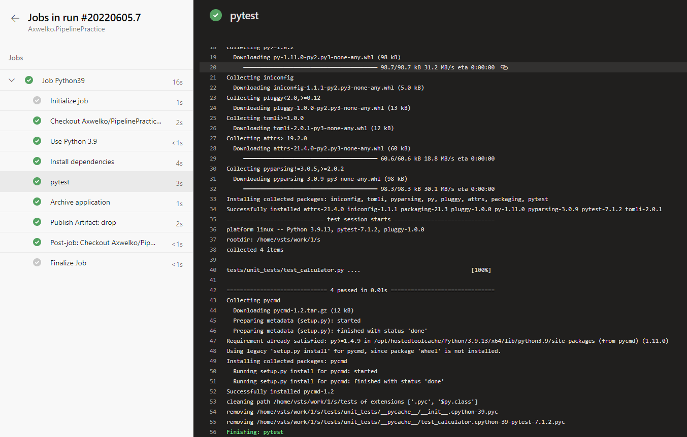
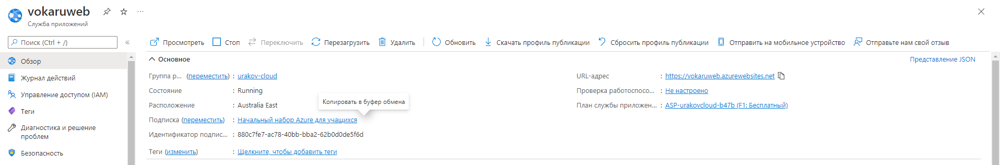
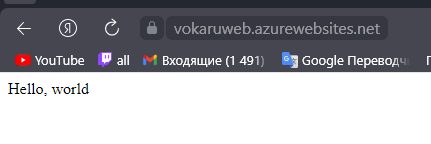
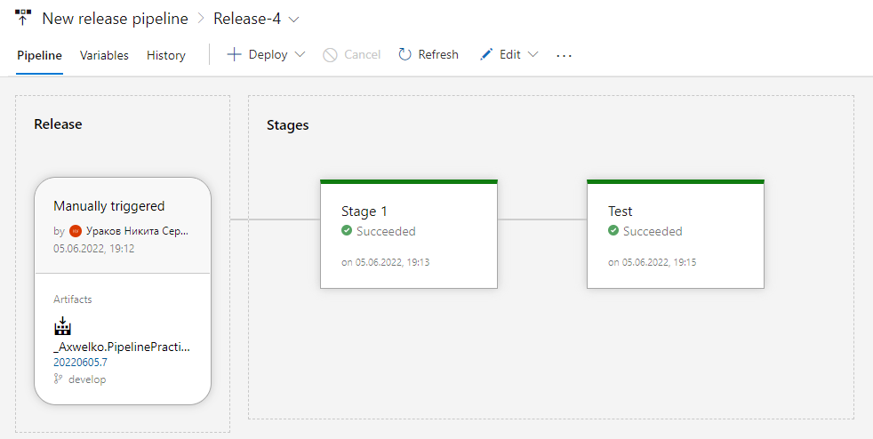
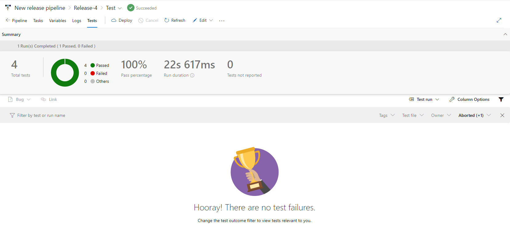
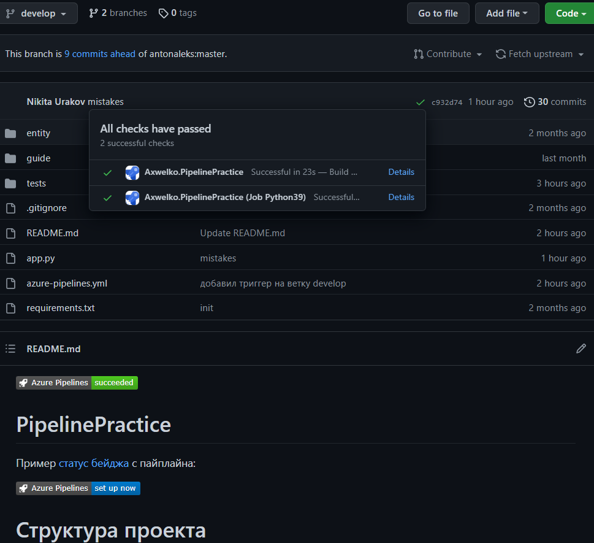

[](https://dev.azure.com/alekseevap/falameev/_build/latest?definitionId=12&branchName=master)

# Отчет о работе с Azure Pipelines.
Данный репозиторий был создан с целью первичного взаимодействия с Azure Pipelines.
На основе простого приложения, выполняющего функции калькулятора, был создан примитивный веб-интерфейс, а также созданы функциональные и программные тесты. 
Результаты прохождения программных тестов в рамках Pipeline: 



Веб-приложение в Azure DevOps:



В ходе развертвания веб-приложения в Azure DevOps мы получили ссылку на него:
```html
https://vokaruweb.azurewebsites.net/  # спойлер - она сейчас не будет работать
```
Перейдя по ссылке мы попадаем на страницу с нашим веб-приложением: 



Для взаимодействия с приложением следует в поисковой строке к запросу приписать:
Функцию для исполнения приложением:
1. /add
2. /multiply
3. /subtract
4. /divide

И значения для обработки данной функцией в следующем виде:

/<Значение 1>&<Значение 2>

Пример результатов взаимодествия с веб-приложением:


Настроенный пайплайн в Azure DevOps для запуска релиза:



Результаты прохождения функциональных тестов и релиз в Azure DevOps:



В результате прохождения всех тестов и выпуска приложения репозиторий гитхаба бул отмечен зеленной галочкой: 


